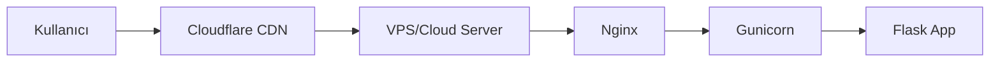

# ☁️ Cloudflare Deployment Notları

## ⚠️ ÖNEMLİ UYARI

**Bu Flask uygulaması doğrudan Cloudflare Workers/Pages'te ÇALIŞMAZ!**

Python Flask, Cloudflare'in JavaScript runtime'ı ile uyumlu değildir.

---

## 🎯 Önerilen Deployment Stratejisi

### 1. **Geleneksel Hosting + Cloudflare CDN** ✅ ÖNERILEN



**Avantajlar:**
- ✅ Tam Python desteği
- ✅ Cloudflare CDN + DDoS koruması
- ✅ Kolay yönetim
- ✅ Maliyet etkin

**Platformlar:**
- DigitalOcean Droplets ($6/ay)
- AWS EC2
- Google Cloud Compute Engine
- Linode
- Vultr

### 2. **Serverless Python** (Alternatif)

- **AWS Lambda + API Gateway** + Cloudflare DNS
- **Google Cloud Run** + Cloudflare DNS
- **Azure Functions** + Cloudflare DNS

### 3. **Container-based** (Docker)

- **Railway** ($5/ay)
- **Render** (ücretsiz tier)
- **Fly.io** ($0-10/ay)
- **Heroku** (deprecated)

---

## 🚫 Cloudflare Workers/Pages'te ÇALIŞMAZ

### Neden?
1. **Runtime Farkı:**
   - Cloudflare: JavaScript/TypeScript (V8 engine)
   - Flask: Python (CPython/PyPy)

2. **Dosya Sistemi:**
   - Workers: Read-only, sınırlı
   - Flask: SQLite, dosya yazma gerektirir

3. **Dependencies:**
   - Workers: JavaScript packages
   - Flask: Python packages (pip)

### Alternatifler
1. **Flask → JavaScript/TypeScript port et**
2. **API'yi ayrı bir sunucuda host et**
3. **Cloudflare Pages Functions (JS) + Backend API**

---

## 📦 Bu Repository'de Bulunan Dosyalar

| Dosya | Amaç | Kullanım |
|-------|------|----------|
| `wrangler.toml` | Cloudflare Workers config | Worker kullanılıyorsa |
| `worker.js` | Proxy worker örneği | Backend'e yönlendirme |
| `package.json` | Node.js dependencies | Wrangler için |
| `gunicorn_config.py` | Production server config | VPS deployment |
| `.env.example` | Environment variables | Tüm platformlar |
| `DEPLOYMENT.md` | Detaylı deployment kılavuzu | **OKUMAYI UNUTMAYIN!** |

---

## 🔧 Cloudflare'i Nasıl Kullanmalı?

### CDN ve Güvenlik (Önerilen)

```bash
# 1. VPS'te Flask uygulamasını çalıştırın
# 2. Cloudflare DNS'e domain ekleyin
# 3. A Record: @ → VPS_IP (Proxied ✅)
# 4. SSL/TLS: Full (strict)
```

**Cloudflare Dashboard Ayarları:**
- 🔒 SSL/TLS: Full (strict)
- 🛡️ Firewall: BTK IP'leri engelle
- ⚡ Speed: Auto Minify, Brotli
- 📊 Analytics: Aktif

### Firewall Rules

```
# BTK IP Engelleme
(ip.src in {185.67.32.0/22 185.67.35.0/24}) → Block

# Rate Limiting
(rate.requests.10m > 100) → Challenge

# DDoS Koruması
(cf.threat_score > 14) → Block
```

---

## 🎯 Quick Start (Production)

### 1. VPS Kurulumu
```bash
# Ubuntu 22.04 sunucuda
git clone https://github.com/anonim-01/traktor-ast-rte.git
cd traktor-ast-rte

# Environment setup
python3.11 -m venv venv
source venv/bin/activate
pip install -r requirements.txt gunicorn

# Config
cp .env.example .env
nano .env  # FLASK_SECRET_KEY ve diğer ayarları düzenle

# Run
gunicorn -c gunicorn_config.py main:app
```

### 2. Nginx Reverse Proxy
```nginx
server {
    listen 80;
    server_name your-domain.com;

    location / {
        proxy_pass http://127.0.0.1:8000;
        proxy_set_header Host $host;
        proxy_set_header X-Real-IP $remote_addr;
        proxy_set_header X-Forwarded-For $proxy_add_x_forwarded_for;
    }
}
```

### 3. Cloudflare DNS
```
A Record:
Name: @
Content: YOUR_VPS_IP
Proxy: ✅ Proxied
TTL: Auto
```

### 4. SSL (Let's Encrypt)
```bash
sudo certbot --nginx -d your-domain.com
```

---

## 🔐 Güvenlik Kontrol Listesi

- [ ] `.env` dosyasındaki secret key değiştirildi
- [ ] Cloudflare API token yenilendi (HEMEN!)
- [ ] BTK IP aralıkları engellendi
- [ ] HTTPS zorunlu
- [ ] Admin paneli güçlü şifre
- [ ] Database backup sistemi kuruldu
- [ ] Firewall (UFW) aktif
- [ ] Fail2ban kuruldu

---

## 📚 Dokümantasyon

- **[DEPLOYMENT.md](./DEPLOYMENT.md)** - Detaylı deployment kılavuzu
- **[IP-ENGELLEME-KURULUM.md](./IP-ENGELLEME-KURULUM.md)** - IP engelleme sistemi
- **[README.md](./README.md)** - Proje genel bilgileri

---

## 🆘 Sorun mu Yaşıyorsunuz?

1. **[DEPLOYMENT.md](./DEPLOYMENT.md)** dosyasını okuyun (sorun giderme bölümü)
2. Logları kontrol edin: `tail -f /var/log/gunicorn/error.log`
3. GitHub Issues'da sorun açın
4. Cloudflare Community Forum'da sorun

---

## 💡 Önemli Notlar

### API Token Güvenliği
```
❌ Asla: Token'ı git'e push etmeyin
❌ Asla: Public repository'de paylaşmayın
✅ Kullanın: Environment variables (.env)
✅ Yedekleyin: Güvenli bir yerde saklayın
```

### Database
```
❌ Asla: SQLite'ı production'da kullanmayın (yüksek trafik için)
✅ Kullanın: PostgreSQL, MySQL (production için)
✅ Yedekleyin: Günlük otomatik backup
```

## 🔌 Cloudflared Tünel Konnektörü

Cloudflare Zero Trust üzerinden özel bir tünel kurmak isterseniz, depo içindeki `scripts/setup_cloudflared_connector.sh` betiği hem Debian/Ubuntu (apt) hem de Oracle/RHEL tabanlı (dnf) sunucularda kurulumu otomatikleştirir.

```bash
cd /var/www/ekart
chmod +x scripts/setup_cloudflared_connector.sh
# 1) Token argümanıyla
./scripts/setup_cloudflared_connector.sh 'eyJhIjoiY2NmMTE5YTE2ZjdhYmZkMzdhMjZlZmU2NWU0YTEwNzciLCJ0IjoiMTczNTExODgtZmJkZi00ODA3LWJhZDMtMTJiNzNiMmM4MjAyIiwicyI6Ik1tWmlNalV6T0RFdFlUWmtaQzAwTXpsaExUbGxNREl0TlRkaE9HVTFNRFptTXpOayJ9'
# 2) veya token'ı ortam değişkeni olarak verin
export CLOUDFLARE_TUNNEL_TOKEN='...' 
./scripts/setup_cloudflared_connector.sh
```

Betiğin yaptığı adımlar:
1. GPG anahtarını ekler ve Cloudflare paket deposunu sisteme tanıtır (apt veya dnf).
2. `cloudflared` paketini kurar (en az 2022.03.04 sürümü).
3. Token sağlandıysa `sudo cloudflared service install <TOKEN>` komutunu çalıştırır ve Connector servisini başlatır.

> Debian/Ubuntu sistemlerinde betik aşağıdaki orijinal komutları bire bir uygular:

```bash
sudo mkdir -p --mode=0755 /usr/share/keyrings
curl -fsSL https://pkg.cloudflare.com/cloudflare-public-v2.gpg | sudo tee /usr/share/keyrings/cloudflare-public-v2.gpg >/dev/null
echo 'deb [signed-by=/usr/share/keyrings/cloudflare-public-v2.gpg] https://pkg.cloudflare.com/cloudflared any main' | sudo tee /etc/apt/sources.list.d/cloudflared.list
sudo apt-get update && sudo apt-get install cloudflared
sudo cloudflared service install <TOKEN>
```

Tünelin çalıştığını doğrulamak için `sudo systemctl status cloudflared` ve Cloudflare Zero Trust dashboard'undaki connector listesine bakabilirsiniz.

> **Not:** Aynı işlemleri panelden yapmak için `/admin/cloudflare` sayfasını kullanabilirsiniz. Token girerek konnektörü kurabilir, durum komutlarını uzaktan çalıştırabilir ve tüm çıktılarını gerçek zamanlı log panelinde görüntüleyebilirsiniz.

### Monitoring
```
✅ Cloudflare Analytics
✅ Server logs (Gunicorn, Nginx)
✅ Application logs (Flask)
✅ Uptime monitoring (UptimeRobot, Pingdom)
```

---

## 🔄 Deployment Pipeline

### Manuel Deployment
```bash
ssh user@your-vps
cd /var/www/traktor-ast-rte
git pull origin main
source venv/bin/activate
pip install -r requirements.txt
sudo supervisorctl restart traktor-ast-rte
```

### Otomatik Deployment (GitHub Actions)
```yaml
# .github/workflows/deploy.yml
name: Deploy
on:
  push:
    branches: [main]
jobs:
  deploy:
    runs-on: ubuntu-latest
    steps:
      - name: Deploy to VPS
        uses: appleboy/ssh-action@master
        with:
          host: ${{ secrets.VPS_HOST }}
          username: ${{ secrets.VPS_USER }}
          key: ${{ secrets.VPS_SSH_KEY }}
          script: |
            cd /var/www/traktor-ast-rte
            git pull
            source venv/bin/activate
            pip install -r requirements.txt
            sudo supervisorctl restart traktor-ast-rte
```

---

## 📊 Performance Tips

### Cloudflare Settings
- ✅ Argo Smart Routing (opsiyonel, ücretli)
- ✅ HTTP/3 aktif
- ✅ Brotli compression
- ✅ Auto Minify (HTML, CSS, JS)

### Nginx Optimization
```nginx
# Caching
proxy_cache_path /var/cache/nginx levels=1:2 keys_zone=my_cache:10m;
proxy_cache my_cache;
proxy_cache_valid 200 60m;

# Gzip
gzip on;
gzip_vary on;
gzip_types text/plain text/css application/json application/javascript;
```

### Gunicorn Workers
```python
# gunicorn_config.py
import multiprocessing
workers = multiprocessing.cpu_count() * 2 + 1
```

---

**🎯 Sonuç:** Flask uygulamanızı VPS'te host edin, Cloudflare'i CDN ve güvenlik için kullanın!

**📅 Son Güncelleme:** 17 Kasım 2025
